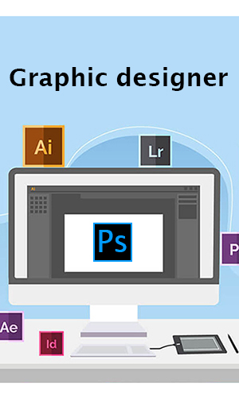

<nav class="navbar navbar-expand-lg navbar-dark bg-dark sticky-top">[Nur](#)<button class="navbar-toggler" type="button" data-toggle="collapse" data-target="#navbarNav" aria-controls="navbarNav" aria-expanded="false" aria-label="Toggle navigation"></button>

*   [Home (current)](#)
*   [programs](#programs)
*   [Education](#education)
*   [English Writing](paragraph.html)
*   [Game](game.html)

</nav>

# Md. Nur E Alam Siddiquee

# Welcome to my Website.

Student, Freelancer, Graphic designer, Web developer and designer.

* * *

Call me a Student or a Freelancer! A curious knowledge-seeker with an appetite to master in-depth wow tecnologies. I want to apply all of them.Yes, I want to be the Einstein of every single thing. Wait a moment, I don't want to spend all of my life only in digging up stuff, I will create a lot of things (I don't know yet...) to change the world

Professionally, I am a student. That's not only way you should look at me. I am a Freelancer, servicing as a Graphic designer and Web developer.

[Learn more](https://www.facebook.com/Md.NurEAlamSiddiquee)

##### Freelancing

I am a Freelancer. I worked as a freelancer in Firverr, Upworks & Freepic market places.

<small class="text-muted"></small>

##### Web developer and designer

I am a Web developer & Web designer. I use HTML & JAVA for web developing. Now I learn C-programming & Web designing.

<small class="text-muted"></small>

##### Graphic designing

I have two years experince in graphic designing. I use Photoshop, Illustrator for graphic designing.

<small class="text-muted"></small>

Education

##### SSC, Monipur High School & College

I completed my SSC exam in 2020.

##### JSC, Monipur High School & College

I completed my JSC exam in 2017\. I got GPA-5 in JSC exam.

##### PEC, Monipur High School & College

I completed my PEC exam in 2014\. I got GPA-5 in PEC exam.

[Go somewhere](https://www.facebook.com/groups/265608491419819)

Leadership

##### Admin & Moderator, Saif Academy

I am an Admin of Saif Academy. I am alos a moderator of that facebook group since 2020.

##### Admin, Programmers' Zone

I am an Admin & leader of Programmers' Zone (facebook & messenger group).

##### President, Editors' CLAN

I am the founder of Editors' CLAN. I was the president of this club since 2018.

##### Vice president, Polapain Club of Amra 13

I was a Vice president of Polapain Club of Amra 13 form 2012 to 2014.

##### Senior Member, G4G1CTBP

I am a seniour member of G4G1CTBP from 2014 to till present.

[Go somewhere](https://www.facebook.com/groups/542386506442854)

<footer>  

Copyright © All right reserved by  
Md.Nur-E-Alam Siddiquee

<table width="100%">

<tbody>

<tr>

<th></th>

<th></th>

<th></th>

</tr>

</tbody>

</table>

</footer>